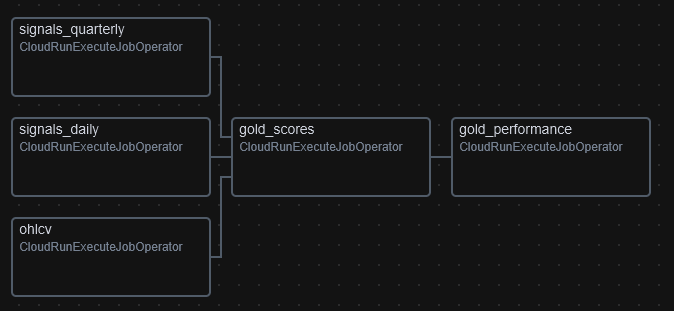

# STOXX Index Intelligence

A cloud-native data platform that tracks the **Euro STOXX 50**, **STOXX Asia/Pacific 50** and **STOXX USA 50** equity indices. Market data is fetched via [yfinance](https://github.com/ranaroussi/yfinance), transformed through a three-layer medallion database (SQL Server on a self-hosted GCE VM), and surfaced in an interactive Blazor/C# dashboard running on Cloud Run. A Python pipeline handles ingestion and scoring, orchestrated by Apache Airflow on a GCE VM. All components are containerized with Docker: the pipeline and dashboard are built as images, pushed to Artifact Registry, and deployed to Cloud Run via GitHub Actions. Locally, `docker-compose` runs the full stack including a SQL Server instance for development. Infrastructure is provisioned with Terraform, and Datadog provides end-to-end observability across metrics, logs and APM traces.

---

## Architecture

The platform is composed of four main subsystems:

| Layer | Technology | Role |
|-------|-----------|------|
| **Ingestion & Transform** | Python 3.12, pandas, pyodbc | Fetch market data, load into SQL, compute scores |
| **Orchestration** | Apache Airflow on GCE | Schedule and trigger pipeline runs |
| **Database** | SQL Server 2022 on GCE VM | Store raw, cleaned and analytics-ready data |
| **Dashboard** | Blazor Server (.NET 9), C# | Interactive UI with real-time updates via SignalR |

Supporting infrastructure:

| Concern | Technology | Role |
|---------|-----------|------|
| **Cloud** | GCP (europe-west1) | Compute, networking, self-hosted SQL |
| **IaC** | Terraform | Provision and manage all GCP resources |
| **CI/CD** | GitHub Actions + Cloud Build | Build Docker images, deploy to Cloud Run |
| **Observability** | Datadog Agent 7, ddtrace | APM traces, metrics, structured logs |

---

## Data pipeline

### Transform & deliver


Data flows through a **medallion architecture** with three layers:

**Bronze** stores raw data exactly as fetched. OHLCV prices, company metadata, valuation signals, quarterly fundamentals, and real-time pulse snapshots all land here unmodified. If something goes wrong downstream, bronze is the source of truth to replay from.

**Silver** is the cleaned layer. OHLCV prices are gap-filled against exchange trading calendars. Company dimensions are tracked with SCD Type 2, preserving full history of sector reclassifications or name changes. Daily and quarterly signals are upserted so silver always holds the latest view.

**Gold** is where analytics happen. Daily scores rank each stock on relative value (z-scored PE, PB, EV/EBITDA), momentum (RSI, moving average crossovers) and sentiment (analyst target upside). Quarterly scores cover quality (margins, ROE, free cash flow), financial health (leverage, liquidity, cash burn) and governance (ISS risk scores). Index performance aggregates cap-weighted returns with rolling windows.

The pipeline runs in **16 ordered steps**, from fetching raw data to computing gold-layer scores. Airflow triggers the full sequence three times daily (after Asian, European and US market closes), with lighter jobs running hourly (active ticker discovery) and every five minutes (real-time pulse snapshots).

For the full schema reference, transform logic and table-by-table documentation:
**[Medallion Architecture Guide](docs/guides/medallion.md)** |
**[Ingestion Guide](docs/guides/ingestion.md)**

---

## Dashboard

The web dashboard is a Blazor Server application running on Cloud Run. It reads exclusively from the gold layer and presents three main views:

- **Overview** — Index-level performance cards, sector heatmaps, top and bottom movers. Designed for a quick scan across all three regions.
- **Stock explorer** — Drill into any stock: daily and quarterly scores, price charts, fundamental metrics, health flags. Compare across sectors with z-score distributions.
- **Pulse (live)** — Real-time board showing the most active stocks across all indices, updated every five minutes via SignalR WebSockets. Volume surges, price ranges, and intraday quotes.

> **C#/Blazor vs React/JS** Blazor Server renders on the backend and pushes UI diffs over a WebSocket. This eliminates the need for a separate API layer: the dashboard queries SQL directly through Entity Framework repositories. For a data-heavy, read-mostly application with a small number of concurrent users, this approach reduces complexity significantly. The trade-off is that it requires a persistent connection per user, which would not scale to thousands of simultaneous sessions. For this use case, it is perfectly acceptable. The .NET ecosystem also provides strong typing end-to-end, from SQL models to Razor components, which catches data contract issues at compile time rather than at runtime.

---

## Orchestration


Apache Airflow runs on a dedicated GCE VM (e2-medium, Container-Optimized OS) with LocalExecutor and PostgreSQL for metadata storage. Four Docker containers: webserver, scheduler, triggerer, and postgres.

Three DAGs handle the workload:

| DAG | Schedule | Scope |
|-----|----------|-------|
| `stoxx_daily` | 09:00, 17:00, 22:00 UTC (Mon-Fri) | Full pipeline: ingest + score (5 task groups) |
| `stoxx_tickers` | Hourly (Mon-Fri) | Active ticker discovery |
| `stoxx_pulse` | Every 5 minutes (Mon-Fri) | Real-time pulse snapshots |

All DAGs use `CloudRunExecuteJobOperator` to trigger the pipeline as a Cloud Run job. Airflow itself does not run any data processing; it only schedules and monitors. This decouples scheduling from execution and keeps the VM lightweight.

### Daily pipeline DAG



The `stoxx_daily` DAG decomposes the pipeline into 5 task groups, each spawning its own Cloud Run job execution. Independent groups run in parallel while downstream tasks wait for their dependencies. Pulse steps (10-13) are excluded here as they are handled by dedicated DAGs (`stoxx_tickers` and `stoxx_pulse`).

| Task | Steps | Depends on |
|------|-------|------------|
| `ohlcv` | 1, 2, 3 | — |
| `signals_daily` | 4, 5, 8 | — |
| `signals_quarterly` | 6, 7, 9 | — |
| `gold_scores` | 14, 15 | `ohlcv`, `signals_daily`, `signals_quarterly` |
| `gold_performance` | 16 | `gold_scores` |

This granularity provides per-group visibility in the Airflow UI, allows individual task retries on failure, and reduces end-to-end runtime through parallel execution.

**[Airflow Guide](docs/guides/airflow.md)**

---

## Observability


Observability is handled by Datadog with three pillars:

**Metrics** are collected by the Datadog Agent running as a container on the Airflow VM. CPU, memory, disk, and container-level metrics flow into Datadog Infrastructure. A GCP integration (via a dedicated service account) pulls Cloud Run metrics.

**Logs** are collected via Docker socket autodiscovery. The pipeline emits JSON-formatted logs with trace correlation IDs, making it possible to jump from a log line directly to the APM trace that produced it.

**Traces** are instrumented with `ddtrace`. Each of the 16 pipeline steps is a span, and SQL queries within each step are automatically traced. Cloud Run jobs send APM data to the Datadog Agent on the VM through a VPC firewall rule (port 8126).

The entire Datadog integration is opt-in. Setting `dd_api_key = ""` in Terraform disables all observability resources in a single apply.

**[Datadog Guide](docs/guides/datadog.md)**

---

## CI/CD & deployment


Every push to `main` triggers a GitHub Actions workflow that:

1. Builds Docker images for the pipeline and dashboard
2. Pushes them to Artifact Registry
3. Updates the Cloud Run service (dashboard) and jobs (pipeline, setup)

Cloud Run performs rolling updates: new instances are spun up before old ones are drained. There is no downtime during deployments.

Infrastructure is managed separately through Terraform. The `infra/` directory contains ~25 resources covering networking, compute, IAM, and secrets. Infrastructure changes are applied manually (`terraform apply`), not through CI, to maintain explicit control over production resources.

**[Terraform Guide](docs/guides/terraform.md)**

---

## Network, secrets & security

### Network isolation

All data-plane traffic stays inside a VPC. The SQL Server VM has no public IP and is reachable only from within the VPC subnet (`10.0.0.0/24`). Cloud Run services and jobs connect to the database through direct VPC networking with egress restricted to `PRIVATE_RANGES_ONLY`, so no database traffic ever traverses the public internet.

Firewall rules follow a deny-all-except model. Internal rules allow SQL traffic on port 1433 and APM trace traffic on port 8126 from the VPC CIDR to the respective VMs. SSH access is restricted to IAP tunnel traffic (`35.235.240.0/20`). Airflow UI access can be granted to a specific admin IP via a Terraform variable (`admin_ip` in gitignored `terraform.tfvars`).

The dashboard is the only public-facing surface. It runs on Cloud Run behind Google's managed load balancer with TLS termination, and serves read-only data from the gold layer. There is no write path from the dashboard to the database.

### Secrets management

Database credentials are stored in **GCP Secret Manager** (`stoxx-db-password`) with automatic multi-region replication. The Cloud Run pipeline job accesses the password at runtime through secret environment variable injection — only the `stoxx-pipeline` service account holds the `secretmanager.secretAccessor` role for this secret. The dashboard receives the connection string (including password) as a plain environment variable set via Terraform, scoped to its own service account.

CI/CD authentication uses a dedicated `stoxx-ci` service account whose JSON key is stored as a GitHub Actions secret (`GCP_SA_KEY`). This account has only the minimum roles needed: `artifactregistry.writer` to push images and `run.developer` to update deployments. It cannot access the database, secrets, or networking resources.

The Datadog API key is stored in Secret Manager and injected into the pipeline Cloud Run job as a secret environment variable. The Airflow VM receives it through GCP instance metadata attributes, retrieved at startup via the metadata server. The entire Datadog integration is opt-in: setting `dd_api_key = ""` in Terraform removes all observability resources.

### IAM & least privilege

Each workload runs under its own service account with scoped roles:

| Service account | Roles | Purpose |
|----------------|-------|---------|
| `stoxx-pipeline` | `secretmanager.secretAccessor` | Pipeline DB + Datadog secret access |
| `stoxx-dashboard` | `secretmanager.secretAccessor` | Dashboard DB secret access |
| `stoxx-airflow` | `run.invoker`, `run.developer`, `logging.viewer` | Trigger Cloud Run jobs |
| `stoxx-ci` | `artifactregistry.writer`, `run.developer`, `iam.serviceAccountUser` | CI/CD deployments |
| `stoxx-datadog` | `monitoring.viewer`, `compute.viewer`, `cloudasset.viewer` | Read-only GCP metrics |

No service account has `editor` or `owner` roles. The CI account can assume pipeline and dashboard identities only for deployment (via `serviceAccountUser`), not for data access.

---

## Data quality

### Idempotency

Every loader and transform is designed to be safely rerunnable. The pipeline uses three idempotency strategies depending on the data characteristics:

**Merge on composite key** — OHLCV prices check for existing `(symbol, date)` pairs before inserting. Duplicate runs skip already-loaded rows. Commits happen in batches of 5,000-10,000 rows to bound memory usage while maintaining throughput.

**Truncate-per-index and reload** — Volatile data like daily signals and pulse snapshots delete all rows for a given index, then insert the fresh snapshot in a single transaction. This guarantees the table always reflects the latest fetch without partial state.

**Upsert with change detection** — Silver-layer transforms pre-load existing rows into memory, compare values, and execute insert/update/skip decisions per row. Unchanged rows are not touched, which avoids unnecessary write amplification and keeps audit trails clean.

### Transactions & rollback

All database operations run inside explicit transactions with `autocommit=False`. Every loader and transform follows the same pattern:

```
try:
    execute operations (batched commits every 5k-10k rows)
    conn.commit()
except Exception:
    conn.rollback()
    log error and propagate
```

Long-running transforms use periodic commits to avoid holding locks across millions of rows. If a failure occurs mid-batch, the rollback reverts only the uncommitted portion — previously committed batches are idempotent and will be skipped on re-run.

### Resilience & recovery

The SQL Server VM runs on a GCE persistent SSD with daily snapshots for backup. The pipeline job is configured with `max_retries = 1` at the Cloud Run level, so a transient failure (OOM, network blip) triggers an automatic retry of the entire job. At the application level, per-index errors are caught and logged without stopping the pipeline — a failed index is skipped and the remaining indices continue. Subsequent scheduled runs recover naturally because every step is idempotent.

> **Why not savepoints and two-phase commits** The data volume is moderate and the pipeline runs frequently (three times daily). If a transform fails, the cost of re-running the entire step from bronze is low — typically under a minute. Adding savepoint complexity for sub-transaction recovery is not worth it when idempotent re-execution achieves the same result with simpler code.

---

## Cost

Running in GCP europe-west1:

| Resource | Monthly cost |
|----------|-------------|
| GCE VM — SQL Server (e2-medium, 30 GB SSD) | ~$25 |
| GCE VM — Airflow (e2-medium, 20 GB) | ~$25 |
| Cloud Run + Artifact Registry | ~$1-5 |
| Datadog (optional, after trial) | ~$50-80 |
| **Total** | **~$50-130/month** |

---

### Cloud deployment

After infrastructure is up, push to `main` to trigger the CI/CD pipeline. Airflow will begin scheduling pipeline runs automatically.

Adding a new index requires only a JSON definition file in `data/definitions/` and running `setup_index.py`. No code changes needed.

---

## Project structure

```
.github/workflows/     GitHub Actions CI/CD
airflow/dags/          Airflow DAG definitions
dashboard/             Blazor Server application (.NET 9 / C#)
data/definitions/      Index configuration files (JSON)
db/ddl/                Database schema scripts (bronze, silver, gold)
db/migration/          DB migration scripts and guide
docker/                Dockerfiles for pipeline and dashboard
docs/guides/           Detailed technical guides
docs/diagrams/         Architecture diagrams
infra/                 Terraform configuration
ingestion/fetchers/    Data fetchers (yfinance API)
ingestion/transforms/  SQL-based transforms (bronze -> silver -> gold)
utils/                 Pipeline orchestrator, config, logging
```

---

## Guides

| Guide | Content |
|-------|---------|
| [Medallion Architecture](docs/guides/medallion.md) | Database schema, table contracts, transform logic, z-score computation |
| [Ingestion Pipeline](docs/guides/ingestion.md) | Fetcher mechanics, loader patterns, 16-step pipeline walkthrough |
| [Airflow Setup](docs/guides/airflow.md) | VM configuration, DAG schedules, container architecture, debugging |
| [Terraform Infrastructure](docs/guides/terraform.md) | GCP resources, networking, IAM, secrets, cost breakdown |
| [Datadog Observability](docs/guides/datadog.md) | Agent setup, APM instrumentation, log correlation, GCP integration |
| [DB Migration](db/migration/DB_Migration_Guide.md) | Cloud SQL to VM migration: 6-step guide with scripts and troubleshooting |
