# STOXX Index Intelligence

A cloud-native data platform that tracks the **Euro STOXX 50**, **STOXX Asia/Pacific 50** and **STOXX USA 50** equity indices. Market data is fetched via [yfinance](https://github.com/ranaroussi/yfinance), transformed through a three-layer medallion database (SQL Server on Cloud SQL), and surfaced in an interactive Blazor/C# dashboard running on Cloud Run. A Python pipeline handles ingestion and scoring, orchestrated by Apache Airflow on a GCE VM. All components are containerized with Docker: the pipeline and dashboard are built as images, pushed to Artifact Registry, and deployed to Cloud Run via GitHub Actions. Locally, `docker-compose` runs the full stack including a SQL Server instance for development. Infrastructure is provisioned with Terraform, and Datadog provides end-to-end observability across metrics, logs and APM traces.

---

## Architecture

The platform is composed of four main subsystems:

| Layer | Technology | Role |
|-------|-----------|------|
| **Ingestion & Transform** | Python 3.12, pandas, pyodbc | Fetch market data, load into SQL, compute scores |
| **Orchestration** | Apache Airflow on GCE | Schedule and trigger pipeline runs |
| **Database** | SQL Server 2022 (Cloud SQL) | Store raw, cleaned and analytics-ready data |
| **Dashboard** | Blazor Server (.NET 9), C# | Interactive UI with real-time updates via SignalR |

Supporting infrastructure:

| Concern | Technology | Role |
|---------|-----------|------|
| **Cloud** | GCP (europe-west1) | Compute, networking, managed SQL |
| **IaC** | Terraform | Provision and manage all GCP resources |
| **CI/CD** | GitHub Actions + Cloud Build | Build Docker images, deploy to Cloud Run |
| **Observability** | Datadog Agent 7, ddtrace | APM traces, metrics, structured logs |

---

## Data pipeline

### Transform & deliver

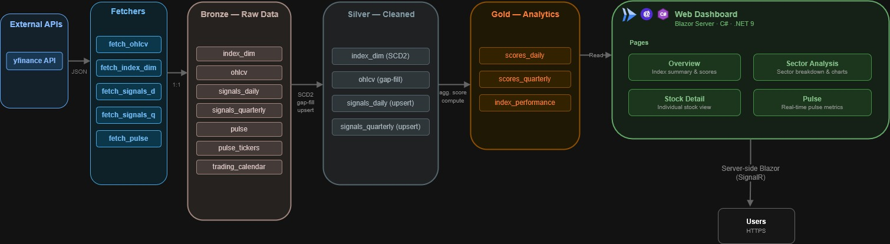

Data flows through a **medallion architecture** with three layers:

**Bronze** stores raw data exactly as fetched. OHLCV prices, company metadata, valuation signals, quarterly fundamentals, and real-time pulse snapshots all land here unmodified. If something goes wrong downstream, bronze is the source of truth to replay from.

**Silver** is the cleaned layer. OHLCV prices are gap-filled against exchange trading calendars. Company dimensions are tracked with SCD Type 2, preserving full history of sector reclassifications or name changes. Daily and quarterly signals are upserted so silver always holds the latest view.

**Gold** is where analytics happen. Daily scores rank each stock on relative value (z-scored PE, PB, EV/EBITDA), momentum (RSI, moving average crossovers) and sentiment (analyst target upside). Quarterly scores cover quality (margins, ROE, free cash flow), financial health (leverage, liquidity, cash burn) and governance (ISS risk scores). Index performance aggregates cap-weighted returns with rolling windows.

> **Medallion vs star schema** The data volume is moderate (hundreds of stocks, daily granularity) and the access patterns are simple: the dashboard reads pre-computed scores by date and symbol. Wide tables avoid the join complexity of fact/dimension models and keep queries fast and straightforward. A star schema would make sense at higher cardinality or with ad-hoc reporting needs, but for this use case, flat gold tables are the pragmatic choice.

The pipeline runs in **16 ordered steps**, from fetching raw data to computing gold-layer scores. Airflow triggers the full sequence three times daily (after Asian, European and US market closes), with lighter jobs running hourly (active ticker discovery) and every five minutes (real-time pulse snapshots).

For the full schema reference, transform logic and table-by-table documentation:
**[Medallion Architecture Guide](docs/guides/medallion.md)** |
**[Ingestion Guide](docs/guides/ingestion.md)**

---

## Dashboard

The web dashboard is a Blazor Server application running on Cloud Run. It reads exclusively from the gold layer and presents four main views:

### Overview

Index-level performance cards, sector heatmaps, top and bottom movers. Designed for a quick scan across all three regions.

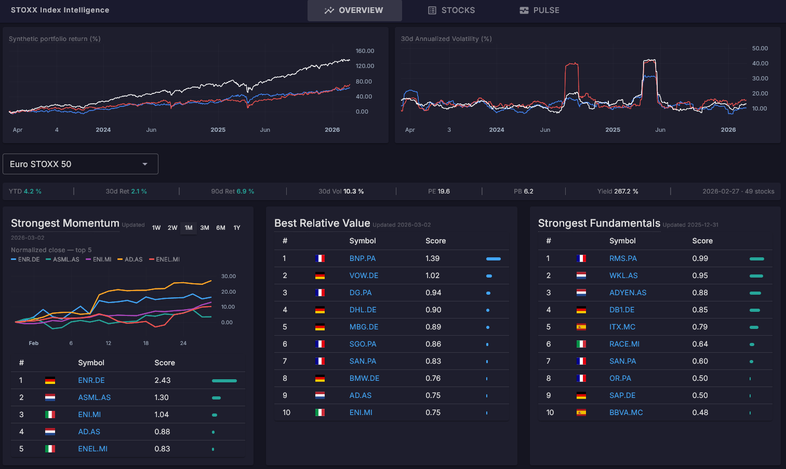

### Stock explorer

Drill into any stock: daily and quarterly scores, price charts, fundamental metrics, health flags. Compare across sectors with z-score distributions.

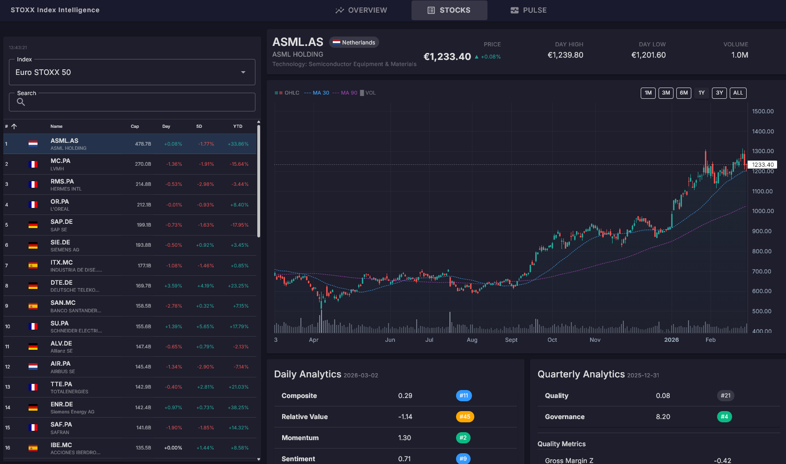

### Pulse (live)

Real-time board showing the most active stocks across all indices, updated every five minutes via SignalR WebSockets. Volume surges, price ranges, and intraday quotes.

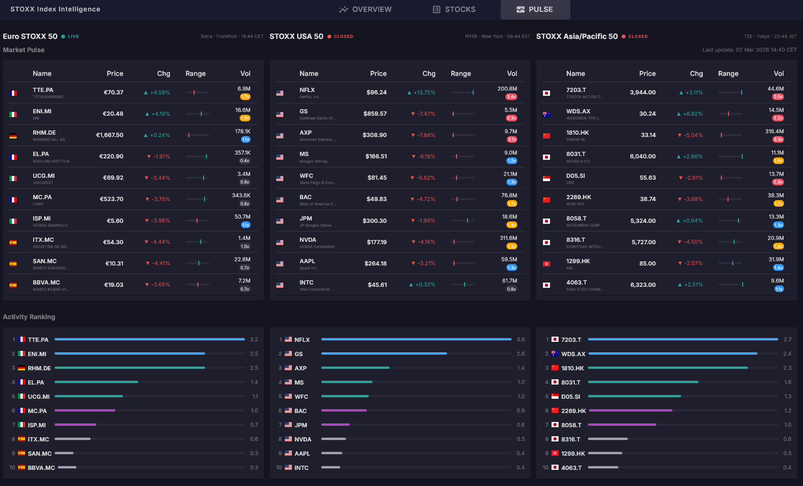

> **C#/Blazor vs React/JS** Blazor Server renders on the backend and pushes UI diffs over a WebSocket. This eliminates the need for a separate API layer: the dashboard queries SQL directly through Entity Framework repositories. For a data-heavy, read-mostly application with a small number of concurrent users, this approach reduces complexity significantly. The trade-off is that it requires a persistent connection per user, which would not scale to thousands of simultaneous sessions. For this use case, it is perfectly acceptable. The .NET ecosystem also provides strong typing end-to-end, from SQL models to Razor components, which catches data contract issues at compile time rather than at runtime.

---

## Orchestration

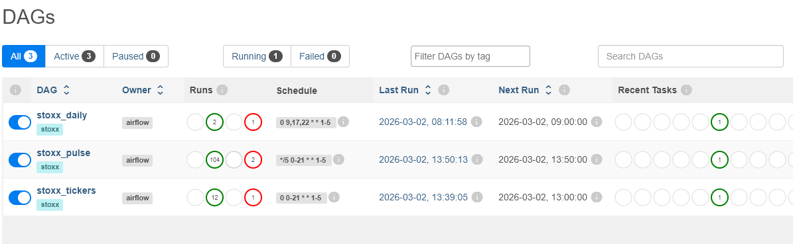

Apache Airflow runs on a dedicated GCE VM (e2-medium, Container-Optimized OS) with LocalExecutor and PostgreSQL for metadata storage. Four Docker containers: webserver, scheduler, triggerer, and postgres.

Three DAGs handle the workload:

| DAG | Schedule | Scope |
|-----|----------|-------|
| `stoxx_daily` | 09:00, 17:00, 22:00 UTC (Mon-Fri) | Full 16-step pipeline |
| `stoxx_tickers` | Hourly (Mon-Fri) | Active ticker discovery |
| `stoxx_pulse` | Every 5 minutes (Mon-Fri) | Real-time pulse snapshots |

All DAGs use `CloudRunExecuteJobOperator` to trigger the pipeline as a Cloud Run job. Airflow itself does not run any data processing; it only schedules and monitors. This decouples scheduling from execution and keeps the VM lightweight.

> **Airflow vs Cloud Scheduler + Pub/Sub?** Airflow provides a UI for monitoring DAG runs, task retries and execution history. For a multi-step pipeline with dependencies between fetchers, loaders and transforms, having visibility into which step failed and why is valuable. Cloud Scheduler would work for simple cron triggers but would require custom tooling for the orchestration layer that Airflow provides out of the box.

**[Airflow Guide](docs/guides/airflow.md)**

---

## Observability

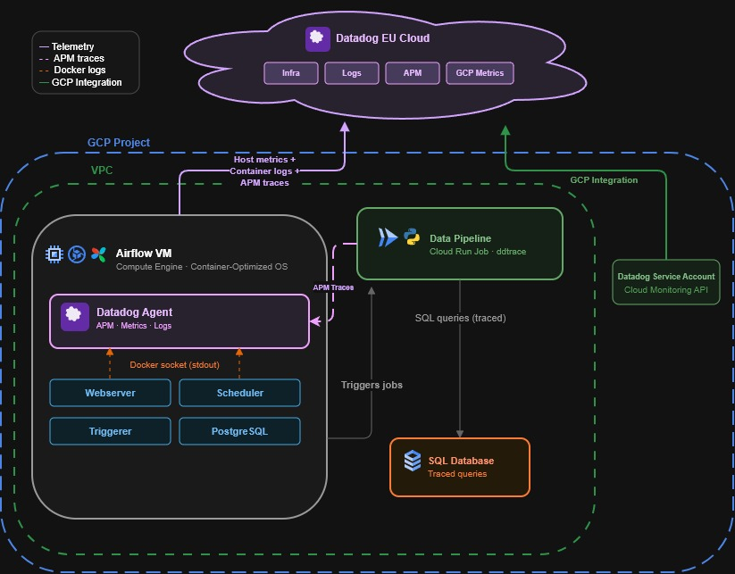

Observability is handled by Datadog with three pillars:

**Metrics** are collected by the Datadog Agent running as a container on the Airflow VM. CPU, memory, disk, and container-level metrics flow into Datadog Infrastructure. A GCP integration (via a dedicated service account) pulls Cloud SQL and Cloud Run metrics.

**Logs** are collected via Docker socket autodiscovery. The pipeline emits JSON-formatted logs with trace correlation IDs, making it possible to jump from a log line directly to the APM trace that produced it.

**Traces** are instrumented with `ddtrace`. Each of the 16 pipeline steps is a span, and SQL queries within each step are automatically traced. Cloud Run jobs send APM data to the Datadog Agent on the VM through a VPC firewall rule (port 8126).

| | |
|---|---|
| 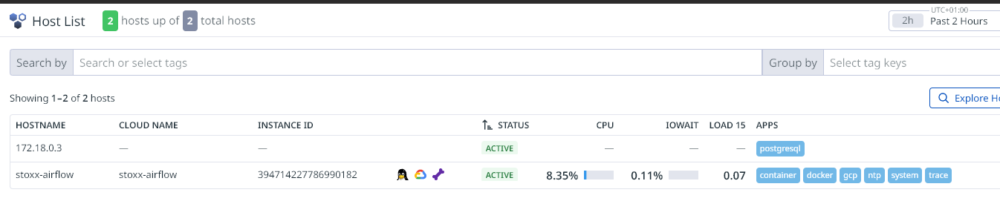 | 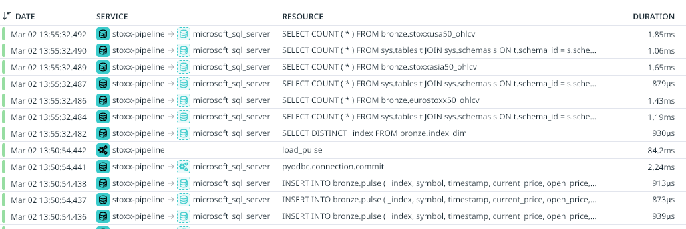 |
| Infrastructure monitoring | APM traces with per-step spans |

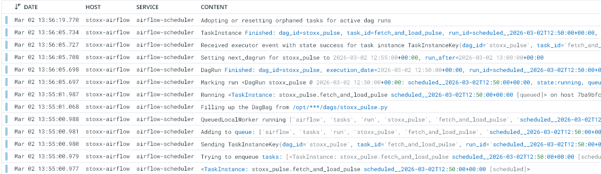

The entire Datadog integration is opt-in. Setting `dd_api_key = ""` in Terraform disables all observability resources in a single apply.

> **Datadog vs Cloud Monitoring + Cloud Logging** GCP's native tools are capable, but Datadog unifies metrics, logs and traces in a single pane with built-in correlation. The APM trace waterfall showing each pipeline step, the SQL queries it ran, and the logs it emitted, all linked together, is genuinely useful for debugging data pipeline issues. The cost (~$50-80/month after trial) is reasonable for the visibility it provides.

**[Datadog Guide](docs/guides/datadog.md)**

---

## CI/CD & deployment

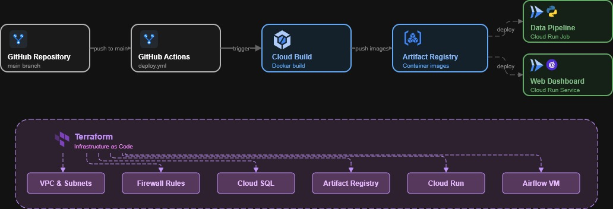

Every push to `main` triggers a GitHub Actions workflow that:

1. Builds Docker images for the pipeline and dashboard
2. Pushes them to Artifact Registry
3. Updates the Cloud Run service (dashboard) and jobs (pipeline, setup)

Cloud Run performs rolling updates: new instances are spun up before old ones are drained. There is no downtime during deployments.

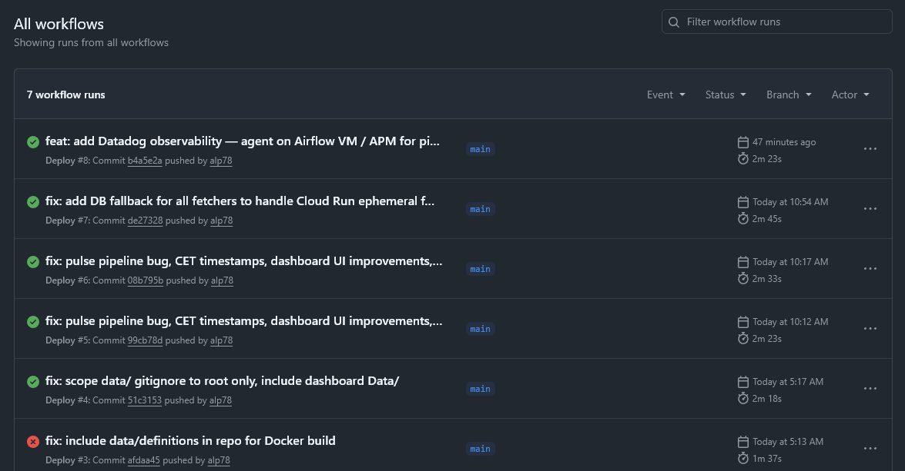

Infrastructure is managed separately through Terraform. The `infra/` directory contains ~25 resources covering networking, compute, database, IAM, and secrets. Infrastructure changes are applied manually (`terraform apply`), not through CI, to maintain explicit control over production resources.

> **GitHub Actions vs Cloud Build** GitHub Actions is where the code already lives, and it handles the build-push-deploy cycle well. Cloud Build could replace it entirely, but the GitHub Actions marketplace and workflow syntax are more accessible for a small team. Terraform is deliberately kept out of CI to avoid accidental infrastructure changes on every push.

**[Terraform Guide](docs/guides/terraform.md)**

---

## Cost

Running in GCP europe-west1:

| Resource | Monthly cost |
|----------|-------------|
| Cloud SQL (SQL Server Express) | ~$55 |
| GCE VM (e2-medium) | ~$25 |
| Persistent disk (20 GB) | ~$2 |
| Cloud Run + Artifact Registry | ~$1-5 |
| Datadog (optional, after trial) | ~$50-80 |
| **Total** | **~$85-165/month** |

---

### Cloud deployment

After infrastructure is up, push to `main` to trigger the CI/CD pipeline. Airflow will begin scheduling pipeline runs automatically.

Adding a new index requires only a JSON definition file in `data/definitions/` and running `setup_index.py`. No code changes needed.

---

## Project structure

```
.github/workflows/     GitHub Actions CI/CD
airflow/dags/          Airflow DAG definitions
dashboard/             Blazor Server application (.NET 9 / C#)
data/definitions/      Index configuration files (JSON)
db/ddl/                Database schema scripts (bronze, silver, gold)
docker/                Dockerfiles for pipeline and dashboard
docs/guides/           Detailed technical guides
docs/diagrams/         Architecture diagrams
docs/images/           Screenshots
infra/                 Terraform configuration
ingestion/fetchers/    Data fetchers (yfinance API)
ingestion/transforms/  SQL-based transforms (bronze -> silver -> gold)
utils/                 Pipeline orchestrator, config, logging
```

---

## Guides

| Guide | Content |
|-------|---------|
| [Medallion Architecture](docs/guides/medallion.md) | Database schema, table contracts, transform logic, z-score computation |
| [Ingestion Pipeline](docs/guides/ingestion.md) | Fetcher mechanics, loader patterns, 16-step pipeline walkthrough |
| [Airflow Setup](docs/guides/airflow.md) | VM configuration, DAG schedules, container architecture, debugging |
| [Terraform Infrastructure](docs/guides/terraform.md) | GCP resources, networking, IAM, secrets, cost breakdown |
| [Datadog Observability](docs/guides/datadog.md) | Agent setup, APM instrumentation, log correlation, GCP integration |
